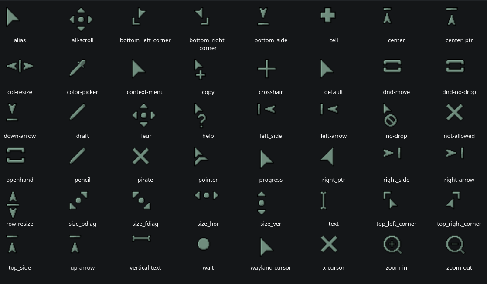

# Nukehaus Cursors
A sage green cursor theme with some pixel graphics made by your friend Nikita (nuke.haus on bluesky)

## Installation
To install the cursor theme simply copy the compiled theme to your icons
directory. For local user installation:

```
./install.sh
```

For system-wide installation for all users:

```
sudo ./install.sh
```

Then set the theme with your preferred desktop tools.

## Preview

